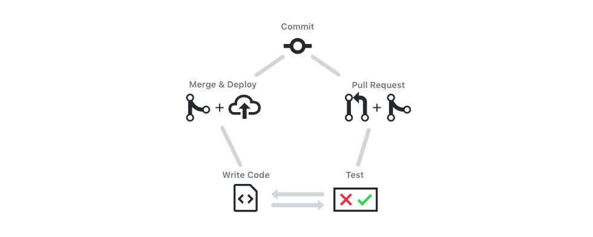
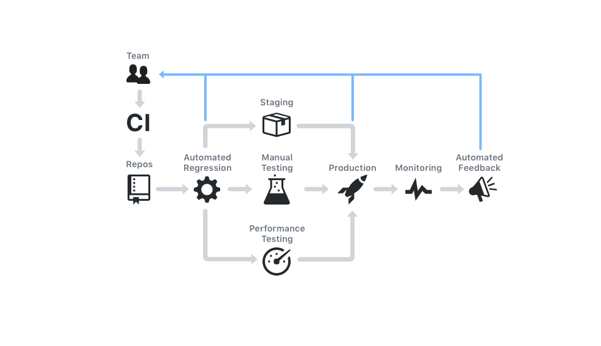

## What is CI/CD?

Continuous Integration and Continuous Deployment tools take manual tasks and do them automatically.

#### Why run tests? Why use CI?
- Test code automatically
- Add structure to development process
- Test driven development (TDD) isn't just the addition of random tests, but rather about building tests as software requirements
- Builds are done on separate servers by the CI services
- Other benefits include consistent configurations, battery of tests, reduces "works on my machine"

#### How does CI/CD work with GitHub?
- When used with GitHub, tests can be run automatically on branches and pull requests every time there is a new commit, and return a status through GitHub's API
- Tests are run in consistent environment based on your software's production environment
- Protected Branches can serve as a gate, keeping pull requests without passing tests from being merged

#### What is the difference between CI and CD?
- **CI**: Continuous integration
  - Continuous Integration is the practice of automatically kicking off tests with each push, rather than ad-hoc testing.
- **CD**: Continuous deployment
  - Code pushed to deployment automatically based on custom circumstances
  - Continuous Deployment is the practice of continuously deploying to production servers. In conjunction with CI, companies can move to a CD model by giving developers the freedom to deploy several times a day upon successful builds. Merging in and of itself isn't considered CD, unless it's tied to some deployment strategy (ex: Heroku automatically deploy anything that gets merged into master).
- We will cover more CI than CD in this course.
  - Though the concepts are different, CI and CD are frequently discussed and implemented together.
  - Typically CI and CD are implemented at the same time because many of the tasks are already defined. For example, a project may already have the tests written, and the steps for deployment. Once a CI/CD tool is introduced, it's simple to have them be done together.

#### Other Things to Think About
- Protected branches
  - On GitHub, you may want to set up protected branches when you set up CI/CD.
  - Protected branches block code from being merged in to the master branch on the remote before it passes a set of configurable requirements, like passing CI/CD tests and builds, or having approved reviews.
- Automatic deploys
  - With CI/CD, you can also set up deploys to happen automatically when code passes the tests on the master branch.
  - Much like many integrations work with GitHub, many deployment options work with CI/CD services.
  - One example is Heroku. You could configure a project on Heroku with a CI/CD service, and whenever a build passes on the master branch, deployment to Heroku would be streamlined and taken care of automatically.
