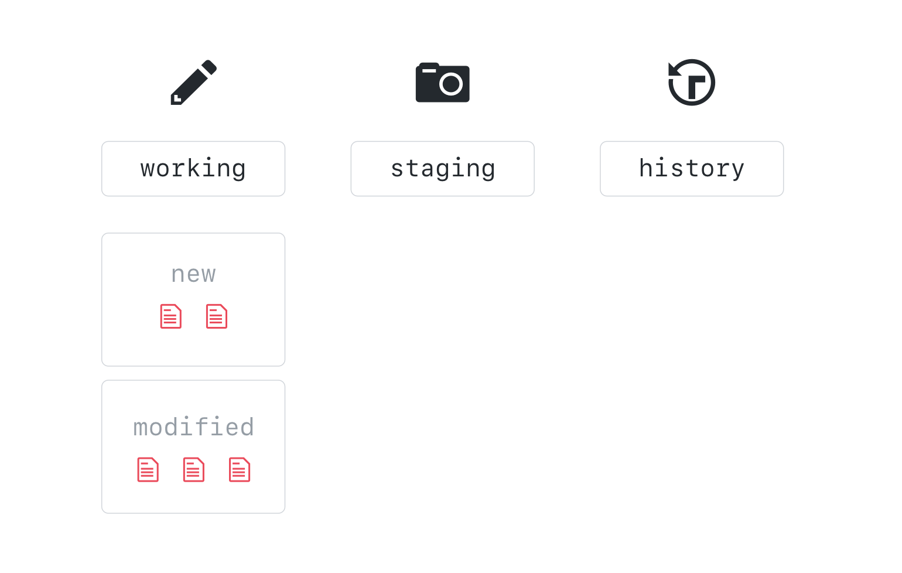
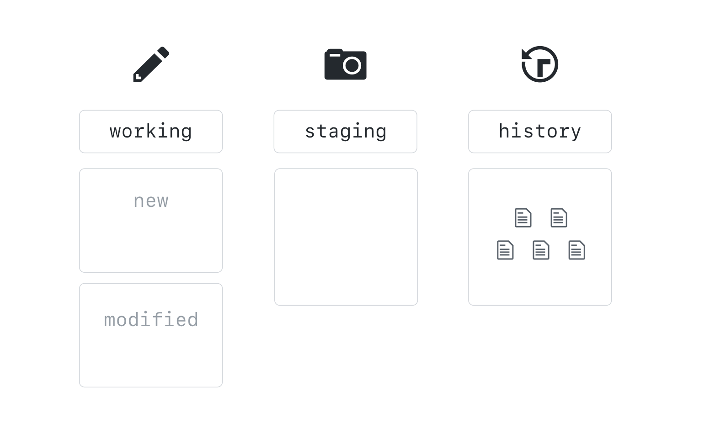

## Working Locally with Git

Using the command line, you can easily integrate Git into your current workflow.

### Creating a Local Copy of the repo


Before we can work locally, we will need to create a clone of the repository.

When you clone a repository you are creating a copy of everything in that repository, including its history. This is one of the benefits of a DVCS like git - rather than being required to query a slow centralized server to review the commit history, queries are run locally and are lightning fast.

Let's go ahead and clone the class repository to your local desktop.

1. Navigate to the **Code** tab of the class repository on GitHub.
1. Click **Clone or download**.
1. Copy the **clone URL** to your clipboard.
1. Open your command line application.
1. Retrieve a full copy of the repository from GitHub: `git clone <CLONE-URL>`
1. Once the clone is complete, cd into the new directory created by the clone operation: `cd <REPOSITORY-NAME>`

### Our Favorite Git command: `git status`

```sh
$ git status
On branch master
Your branch is up-to-date with 'origin/master'.
nothing to commit, working tree clean
```

`git status` is a command you will use often to verify the current state of your repository and the files it contains. Right now, we can see that we are on branch master, everything is up to date with origin/master and our working tree is clean.

### Using Branches locally

```sh
$ git branch
```

If you type `git branch` you will see a list of local branches.

```sh
$ git branch --all
$ git branch -a
```

If you want to see all of the branches, including the read-only copies of your remote branches, you can add the `--all` option or just `-a`.

> The `--all` and `-a` are actually synonyms for the branch command. Git often provides a verbose and a short option.

### Switching Branches

```
$ git checkout <BRANCH-NAME>
```

To checkout the branch you created online, type git checkout and the name of your branch. Git will provide a message that says you have been switched to the branch and it has been set up to track the same remote branch from origin.

> You do not need to type `remotes/origin` in front of the branch - only the branch name. Typing `remotes/origin` in front of the branch name will put you in a detached HEAD state. We will learn more about that later, but for now just remember this is not a state we want to be in.

[include](06a_activity_create_file.md ':include')

### The Two Stage Commit

After you have created your file, it is time to create your first snapshot of the repository. When working from the command line, you will need to be familiar with the idea of the two stage commit.


When you work locally, your files exist in one of four states. They are either untracked, modified, staged, or committed.

An untracked file is a new file that has never been committed.

Git tracks these files, and keeps track of your history by organizing your files and changes in three working trees. They are Working, Staging (also called Index), and History. When we are actively making changes to files, this is happening in the working tree.



To add these files to version control, you will create a collection of files that represent a discrete unit of work. We build this unit in the staging area.


When we are satisfied with the unit of work we have assembled, we will take a snapshot of everything in the staging area. This is called a commit.



In order to make a file part of the version controlled directory we will first do a git add and then we will do a git commit. Let's do it now.

1. First, let's check the status of our working tree: `git status`
1. Move the file from the working tree to the staging area: `git add my-file.md`
1. Let's see what happened: `git status`
1. Now let's take our first snapshot: `git commit`
1. Git will open your default text editor to request a commit message. Simply type your message on the top line of the file. Any line without a # will be included in the commit message.
1. Save and close the commit message
1. Let's take another look at our repository status: `git status`

> Good commit messages should:

- Be short. ~50 characters is ideal.
- Describe the change introduced by the commit.
- Tell the story of how your project has evolved.
